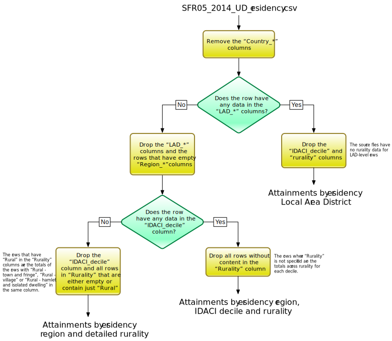

Methodology
===========

##Introduction

Data processing and cleansing developed through the *** stages described below.

- [Stage 1](#stage-1)
- [Stage 2](#stage-2)

###Stage 1

After a first analysis of the set of files that were published, we originally decided to ignore all data but for the contents of the [*SFR05_2014_Underlying_data.zip*](data/raw/SFR05_2014_Underlying_data.zip) file. The rationale for this is that our intention is to prepare the data for exploration without considering the publisher's own conclusions and trying to be influenced by them as little as possible. The zip file's contents are now in the [*01_stage_1*](data/processed/01_stage_1/) folder.

Among the contents, [*SFR05_2014_UD_metadata.txt*](data/processed/01_stage_1/SFR05_2014_UD_metadata.txt) was identified as their key. The file describes elements of the source data's background, coverage, data quality and statistical disclosure (anonymisation). The document also has a full explaination of the acronyms used in the data and a description of the column names for each of the files. 

All the csv tables were loaded into OpenRefine for preliminary analysis. We soon realised that we could not interpret the datasets without studying the final reports, too, starting from [SFR05_2014_National_and_LA_tables.xls](data/raw/SFR05_2014_National_and_LA_tables.xls) where, by using formatting and indentation, the semantics of the data is clearly highlighted to the "human reader". 

A very good example is the *SFR05_2014_UD_residency.csv* file. Like most other files in the dataset, the file includes several **alternative** perspectives on the same data, that can be isolated from each other only by interpreting and filtering the values in the rows. The diagram below shows how the original file was 'distilled' into its three different perspectives.

The filenames can also be misleading, e.g. the two *SFR05_2014_UD_national_1.csv* and *SFR05_2014_UD_national_2.csv* files, are not one the continuation of the other, despite their names, and have different column sets.

Please note that we are no saying that the data was in anyway 'faulty' at this stage, but it was of difficult interpretarion and re-use because of some of the choices that were made by the issuer.

###Stage 2

In stage 2 we normalised the data in the *01_stage_1* folder trying to achieve a "canonical form" for the same. Redundant data was removed and the original csv files were split in specialised csv files each of which presented one and just one perspective on the data. The result is in [*01_stage_2*](data/processed/02_stage_2/). The names of the files produced during this stage are self-explanatory.

Below is the description of which output files were produced by which input files.

Source file | Destination file(s) 
----------- | ------------------- 
*SFR05_2014_UD_national_1.csv* | *Attainments_by_EAL.csv* *Attainments_by_FSM.csv* *Attainments_by_SEN_provision.csv* *Attainments_by_SEN_type.csv* *Attainments_by_disadvantage.csv* *Attainments_by_disadvantaged_schools.csv* *Attainments_by_ethnicity.csv* 

Note that all files distinguish attainment also by the pupil's gender, but that is not specified in the filename.

For each of the files, we:
- removed any empty rows
- removed any redundant columns: e.g. "Country_code_9_digit", "Country_code" and "Country_name" that have the same values for all records, respectively "E92000001", 921 and "England"
- identified and removed any rows that had consolidated data from other rows (totals by region, totals by rurality, etc.)

When necessary, we 'specialised' the contents of the *Characteristic_category* column, e.g. in *Attainments_by_SEN_provision.csv* we highlighted that "School Action" and "School Action+" are SEN categories "without a statement".

The files were processed using OpenRefine. The operation history for each file is in the [scripts/stage_2](script/stage_2) folder. The filenames are the same as the csv they produced, but end with a *.openrefine.json* extension.

---

Source file | Destination file(s) 
----------- | ------------------- 
*SFR05_2014_UD_national_2.csv* | *Attainments_by_SEN_provision_and_ethnicity.csv*

The operations on the files were the same as for *SFR05_2014_UD_LA_1.csv*.

---

Source file | Destination file(s) 
----------- | ------------------- 
*SFR05_2014_UD_LA_1.csv* | *Attainments_by_LA.csv*

For each of the files, we:
- identified and removed any rows that had consolidated data from other rows (totals, etc.)
- identified and removed all redundant columns that had totals for boys and girls belonging to the same category

The files were processed using the *Attainments_by_LA.R* R script in the [scripts/stage_2](script/stage_2) folder..

---

Source file | Destination file(s) 
----------- | ------------------- 
*SFR05_2014_UD_LA_2.csv* | *Attainments_by_LA_et_al.csv*

The operations on the files were the same as for *SFR05_2014_UD_LA_1.csv*.

---

Source file | Destination file(s) 
----------- | ------------------- 
*SFR05_2014_UD_parliamentary_constituency.csv* | *Attainments_by_parliamentary_constituency.csv*

The operations on the files were the same as for *SFR05_2014_UD_LA_1.csv*.

---

Source file | Destination file(s) 
----------- | ------------------- 
*SFR05_2014_UD_residency.csv* | *Attainments_by_residency_region_IDACI_rurality.csv* *Attainments_by_residency_region_and_rurality_detail.csv* *Attainments_by_residency_LAD.csv*

The operations on the files were the same as for *SFR05_2014_UD_LA_1.csv*.

---

Source file | Destination file(s) 
----------- | ------------------- 
*SFR05_2014_UD_school_location.csv* | *Attainments_by_school_region_and_rurality_detail.csv* *Attainments_by_school_LAD.csv*

The operations on the files were the same as for *SFR05_2014_UD_LA_1.csv*.
